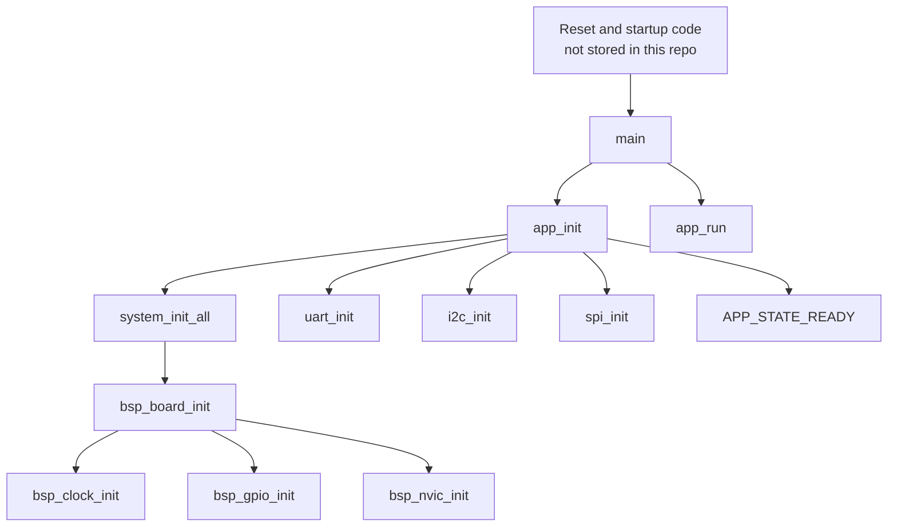
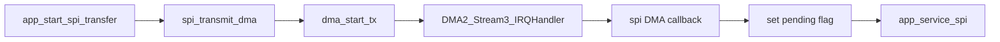

# Architecture

## Overview

The firmware is organized as a layered bare-metal application for an `STM32F407VGT6`-based development board. The structure separates board-specific initialization, peripheral access, and application behavior so that the core logic is easier to read and extend.

```text
main.c
  -> Application
       -> System facade
            -> BSP
       -> UART / I2C / SPI drivers
       -> SPI -> DMA driver
       -> UART RX -> ring buffer
```

The design is intentionally simple:

- No RTOS.
- No STM32 HAL or LL.
- No dynamic allocation.
- Short interrupt handlers that hand work back to the main loop.

## Module Responsibilities

| Module | Key files | Responsibility |
| --- | --- | --- |
| Entry point | `main.c` | Starts the firmware by calling `app_init()` and `app_run()` |
| Application | `Application/app.c`, `Application/app.h`, `Application/app_config.h` | Owns system state, command parsing, LED policy, button handling, I2C test command, and SPI transfer orchestration |
| System facade | `System/system_init.c`, `System/system_init.h` | Keeps a stable initialization API and delegates to the board layer |
| BSP | `BSP/stm32f4_discovery.c`, `BSP/stm32f4_discovery.h`, `BSP/board.h` | Configures clocks, GPIO alternate functions, NVIC priorities, LEDs, and button input |
| UART driver | `Drivers/uart/*` | Handles `USART1` setup, blocking transmit, RX interrupt, and ring-buffer integration |
| I2C driver | `Drivers/i2c/*` | Provides polling-based `I2C1` master read/write transactions |
| SPI driver | `Drivers/spi/*` | Configures `SPI1` and uses DMA for TX transfers |
| DMA driver | `Drivers/dma/*` | Implements `DMA2 Stream3 Channel3` transfers used by the SPI TX path |
| Utility layer | `Utils/ring_buffer.*` | Supplies a single-producer/single-consumer byte ring buffer |

## Initialization Flow

The boot path is small and explicit.



`System/system_init.c` is a lightweight compatibility layer. The real hardware work happens in the BSP.

## Runtime Control Flow

`app_run()` loops forever and repeatedly calls `app_process()`.

`app_process()` performs the following work in order:

1. Increment `loop_count`.
2. Drain pending UART bytes from the ring buffer and parse commands.
3. Poll the user button and debounce it with a loop counter.
4. Check whether an SPI DMA callback has posted a pending event.
5. Update the heartbeat LED based on `APP_HEARTBEAT_DIVIDER`.

This is a cooperative design. Long blocking operations in the foreground code would directly affect responsiveness.

## Application State Model

The application tracks a small state machine plus diagnostic counters.

| State | Meaning |
| --- | --- |
| `APP_STATE_BOOT` | Initial value before initialization completes |
| `APP_STATE_READY` | Firmware is ready to accept commands |
| `APP_STATE_SPI_BUSY` | An SPI DMA transfer is in progress |
| `APP_STATE_ERROR` | An error condition has been latched |

`app_status_t` also stores:

- `loop_count`
- `spi_transfer_count`
- `spi_error_count`
- `dma_error_count`
- `i2c_success_count`
- `i2c_error_count`
- `last_i2c_sample[]`

## Interrupt and Deferred-Work Strategy

The code keeps ISR work short and shifts user-visible behavior into the main loop where possible.

### UART receive path


Behavior:

- `USART1_IRQHandler()` reads `USART_SR` and `USART_DR`.
- RX data is pushed into the ring buffer.
- Framing/noise/overrun counters are incremented internally inside the UART driver.
- Command parsing happens later in `app_service_uart()`.

### SPI DMA path



Behavior:

- The application fills `app_spi_tx_buffer[]` before starting DMA.
- The DMA interrupt notifies the SPI layer.
- The SPI callback does not finalize the transaction immediately.
- `app_service_spi()` later checks `spi_is_busy()` so the code does not declare completion before `SPI_SR.BSY` clears.

This is a sensible pattern for keeping interrupt handlers small while still respecting the SPI peripheral's final shift-out timing.

## Hardware Ownership by Layer

| Layer | Owns |
| --- | --- |
| BSP | Clock tree, GPIO mode/AF setup, peripheral clock enables, NVIC priorities, LEDs, button input |
| UART driver | `USART1` register programming and RX interrupt servicing |
| I2C driver | `I2C1` register programming and polling transactions |
| SPI driver | `SPI1` configuration and DMA TX trigger path |
| DMA driver | `DMA2 Stream3 Channel3` stream programming and IRQ handling |
| Application | Transaction policy, state transitions, CLI behavior, and diagnostic output |

## Design Strengths

- Clear separation between board-specific initialization and application logic.
- Explicit, readable control flow.
- DMA and interrupt handling kept reasonably contained.
- Useful embedded demonstration value for interview or portfolio discussion.

## Known Architectural Gaps

- No timer abstraction or time base; heartbeat and button debounce rely on loop counts.
- No scheduler or event queue beyond a few manual flags.
- No generic driver configuration model for multiple instances or multiple boards.
- No vehicle-domain modules yet, such as motor control, odometry, or sensor fusion.
- No checked-in startup/linker/build baseline, so the repo is currently source-centric rather than fully reproducible.
